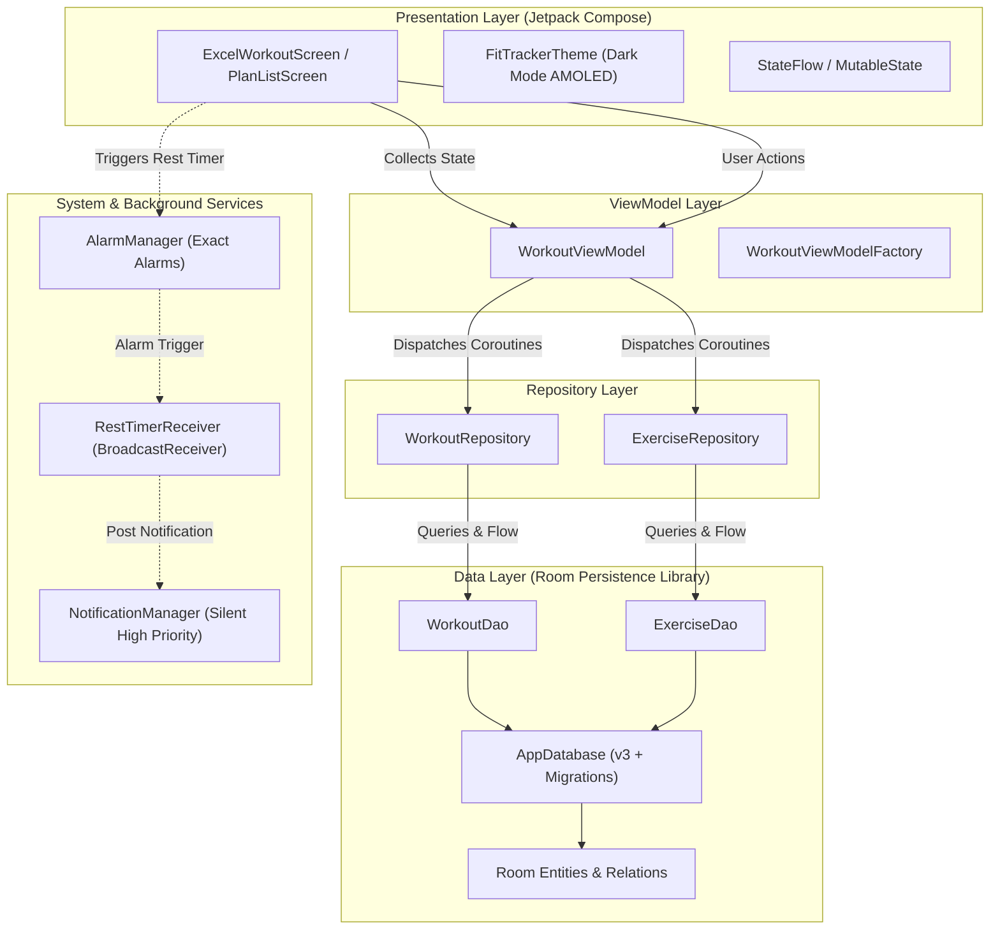
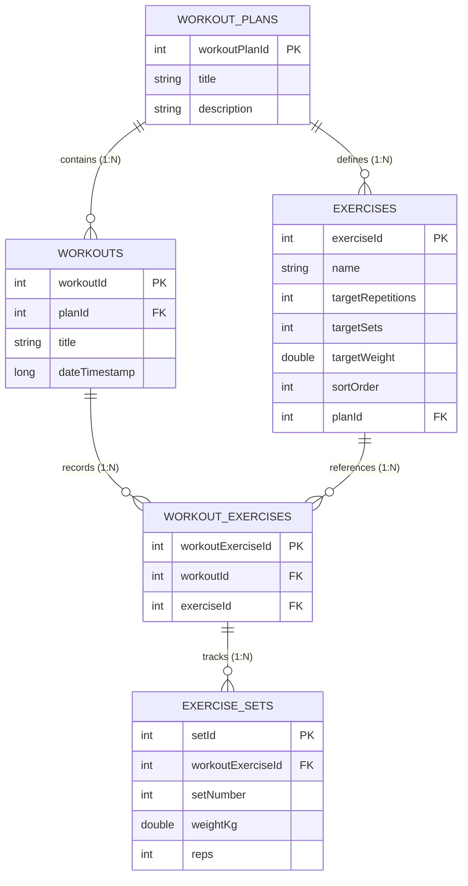

<div align="center">

  

  # FitTracker
  
  **Modern, spreadsheet-inspired workout logger & progression tracker built with Jetpack Compose and Room.**

---
</div>
## About The Project

Most traditional workout loggers suffer from **modal fatigue** and high input friction—requiring athletes to navigate deep menu trees, press multiple confirmation popups, and click between fragmented screens just to record a single set.

**FitTracker** reimagines workout logging for serious gym-goers and lifters who want the speed, visibility, and density of an **Excel spreadsheet** combined with the ergonomics of a modern mobile app. 

### Why FitTracker?
- **Zero-Friction Logging**: View all exercises and session history side-by-side in a responsive 2D matrix.
- **Immediate Progressive Overload Feedback**: Compare today’s performance directly against previous session weights and reps at a single glance.
- **Gym-Optimized Rest Management**: Automated exact rest timers wake the screen without interrupting sounds.

---

## Key Features

### Spreadsheet-Inspired 2D Workout Matrix
- **Dual-Axis Navigation**: Exercises are pinned vertically on the Y-axis while training sessions scroll smoothly horizontally along the X-axis.
- **Expandable / Collapsible Columns**:
  - *Collapsed State*: Clean summary displaying the last completed set (e.g., `100kg x 8`).
  - *Expanded State*: In-place inline editors for all sets (weight & reps) with instant reactive persistence.
- **Dynamic Session Addition**: Append new workout days with a single tap, auto-stamped with the current date.

### Reliable Background Rest Interval Engine
- **Hardware-Accurate Alarms**: Powered by Android's `AlarmManager` (`setExactAndAllowWhileIdle`), guaranteeing timely wake-ups even during battery optimization/Doze mode.
- **Lock Screen & Heads-Up Alerts**:
  - Automatically turns on the screen and displays over the keyguard (`setShowWhenLocked`, `setTurnScreenOn`).
  - Non-intrusive silent notification channel (`IMPORTANCE_HIGH` banner without audio interruption for headphone users).
  - Quick action buttons directly from the notification: **`+1 Minuta`** (extend rest) or **`Zamknij`** (dismiss).
- **Auto-Trigger on Set Completion**: Triggered automatically when sets are registered, minimizing manual screen taps.

### Workout Plan & Exercise Catalog Management
- **Full Plan Customization**: Create and maintain multiple training splits (e.g., Push/Pull/Legs, Upper/Lower, 5x5).
- **Reordering & Hierarchy**: Custom sort order controls (▲ / ▼) with real-time index synchronization in the database.
- **Target Metrics Configuration**: Define goal reps and target set volume per exercise.

### Non-Destructive Data Management
- Foreign key constraints with cascading deletes where appropriate (`WorkoutEntity` ➔ `WorkoutExerciseEntity` ➔ `ExerciseSetEntity`).
- Graceful handling for catalog modifications: Removing exercises from active plans detaches them cleanly without wiping historical workout logs.

### AMOLED Dark Mode & Modern Ergonomics
- High-contrast dark theme (`#0A0A0A` / `#141414`) with vivid neon accent green (`#4CAF50`) and purple highlights (`#7245FA`) tailored for low-light gym environments.
- Edge-to-edge support with custom inset handling (`imePadding()`, `statusBarsPadding()`, `navigationBarsPadding()`).

---

## Architecture & Engineering

FitTracker adheres to **Official Android Architecture Guidelines**, enforcing **Unidirectional Data Flow (UDF)** and separation of concerns across presentation, domain, and data layers.



### Presentation Layer
- **Declarative UI**: Built 100% with **Jetpack Compose** using Material 3 design elements.
- **Lifecycle-Aware State Collection**: Exposes `StateFlow` streams utilizing `SharingStarted.WhileSubscribed(5000)` to optimize system resources during configuration changes.
- **Complex Gesture & Layout Management**: Custom synchronized 2D scrolling layout combining `horizontalScroll` states with `LazyColumn` for peak rendering performance.

### ViewModel & Reactive Coroutines
- Relational reactive pipelines using Kotlin `Flow` and `flatMapLatest`.
- Asynchronous database transactions scheduled on optimal coroutine dispatchers via `viewModelScope`.

### System Services & Backward Compatibility
- Graceful handling of Android 12+ (API 31) exact alarm policies via `canScheduleExactAlarms()` with fallback mechanisms.
- Dynamic runtime permission checking for `POST_NOTIFICATIONS` (Android 13+, API 33).

---

## Database Design

The data layer uses **SQLite** through **Android Room** with foreign key constraints, relational indexing, and migration support:



### Deep Relational Trees with Room
The app leverages `@Relation` and `@Embedded` structures (`WorkoutWithDetails`, `WorkoutExerciseDetails`) to fetch multi-layered relational data trees in single `@Transaction` queries, guaranteeing data consistency without N+1 query bottlenecks.

---

##️ Tech Stack & Tools

| Domain | Technology / Library | Description |
| :--- | :--- | :--- |
| **Language** | [Kotlin](https://kotlinlang.org/) | 100% Kotlin codebase with Coroutines & Flow |
| **UI Framework** | [Jetpack Compose](https://developer.android.com/jetpack/compose) | Declarative UI toolkit (Compose BOM `2024.10.01`) |
| **Design System** | [Material Design 3](https://m3.material.io/) | Modern Material 3 theming and components |
| **Database** | [Room](https://developer.android.com/training/data-storage/room) (`2.6.1`) | SQLite abstraction with KSP compiler & migrations |
| **Annotation Processing** | [KSP](https://kotlinlang.org/docs/ksp-overview.html) | Kotlin Symbol Processing for fast code generation |
| **Architecture** | MVVM + Repository Pattern | Clean separation of concerns and Unidirectional Data Flow |
| **Async & Reactive** | Kotlin Coroutines & Flow | Asynchronous reactive streams and state handling |
| **Lifecycle** | AndroidX Lifecycle `2.8.7` | `lifecycle-runtime-ktx`, `lifecycle-viewmodel-compose` |
| **Background Processing** | `AlarmManager` & `BroadcastReceiver` | Exact hardware-level alarms & pending notification intents |
| **System Compatibility** | AndroidX SplashScreen API | Polished cold-start launch experience |
| **Build Tool** | Gradle Kotlin DSL (`build.gradle.kts`) | Modern Gradle configuration script |

---

## Project Directory Structure

```text
fitTracker/
├── app/
│   ├── src/main/
│   │   ├── AndroidManifest.xml          # Permissions, receivers & activities
│   │   ├── java/com/czyz/fittracker/
│   │   │   ├── MainActivity.kt          # Edge-to-edge setup & permission dispatch
│   │   │   ├── WorkoutViewModel.kt      # State management & business logic
│   │   │   ├── ExcelWorkoutScreen.kt    # Compose UI (Matrix grid, plans & dialogs)
│   │   │   │
│   │   │   ├── dao/                     # Room Data Access Objects
│   │   │   │   ├── ExerciseDao.kt       # Exercise catalog queries & CRUD
│   │   │   │   └── WorkoutDao.kt        # Workout, plans & relational queries
│   │   │   │
│   │   │   ├── database/                # Database configuration
│   │   │   │   └── RoomDatabase.kt      # AppDatabase setup & version migrations
│   │   │   │
│   │   │   ├── entity/                  # Database Entities & Relation models
│   │   │   │   ├── WorkoutPlanEntity.kt
│   │   │   │   ├── WorkoutEntity.kt
│   │   │   │   ├── ExerciseEntity.kt
│   │   │   │   ├── WorkoutExerciseEntity.kt
│   │   │   │   ├── ExerciseSetEntity.kt
│   │   │   │   └── WorkoutExerciseDetails.kt
│   │   │   │
│   │   │   ├── repository/              # Repository layer abstraction
│   │   │   │   ├── ExerciseRepository.kt
│   │   │   │   └── WorkoutRepository.kt
│   │   │   │
│   │   │   ├── timer/                   # Background rest timer subsystem
│   │   │   │   ├── RestTimerManager.kt  # Exact alarm scheduling
│   │   │   │   └── RestTimerReceiver.kt # Broadcast receiver & notification actions
│   │   │   │
│   │   │   └── ui/theme/                # Typography, color tokens & theme provider
│   │   │       ├── Color.kt
│   │   │       ├── Theme.kt
│   │   │       └── Type.kt
│   │   │
│   │   └── res/                         # Vector drawables, mipmaps & values
│   │
│   └── build.gradle.kts                 # App module dependencies & compiler options
├── build.gradle.kts                     # Root build configuration
├── settings.gradle.kts                  # Plugin & repository management
└── README.md
```

---

## Getting Started

### Prerequisites
- **Android Studio**: Ladybug (2024.2+) or newer
- **JDK**: Version 17 or Version 21 recommended
- **Android SDK**: API Level 35 (Android 15) installed
- **Device / Emulator**: Android 8.0 (API level 26) or higher

### Installation & Run

1. **Clone the repository:**
   ```bash
   git clone https://github.com/BartlomiejCzyz/fitTracker.git
   cd fitTracker
   ```

2. **Open in Android Studio:**
   - Launch Android Studio, select **Open**, and navigate to the cloned `fitTracker` root folder.
   - Wait for the Gradle sync to finish downloading all dependencies.

3. **Build the project via terminal:**
   ```bash
   # On macOS/Linux:
   ./gradlew assembleDebug

   # On Windows:
   .\gradlew.bat assembleDebug
   ```

4. **Run on Device or Emulator:**
   - Press **Shift + F10** or click the green **Run ▶** button in Android Studio.

---

## Future Roadmap

- [ ] **Settings**:
  - Adding settings to adjust default values like number of sets or break time.
- [ ] **Custom Timer Presets**:
    - Per-exercise rest intervals (e.g., 3 minutes for squats, 90 seconds for isolation work).
- [ ] **Multiple language support**:
  - Support for other languages 
- [ ] **Wear OS Companion Module**:
  - Wrist-based timer notifications and quick set completion ticks directly from smartwatches.


---

## Author

**Bartłomiej Czyż**

- **GitHub**: [@BartlomiejCzyz](https://github.com/BartlomiejCzyz)
- **Project Repository**: [fitTracker](https://github.com/BartlomiejCzyz/fitTracker)

---

## License

This project is licensed under the **MIT License**.
